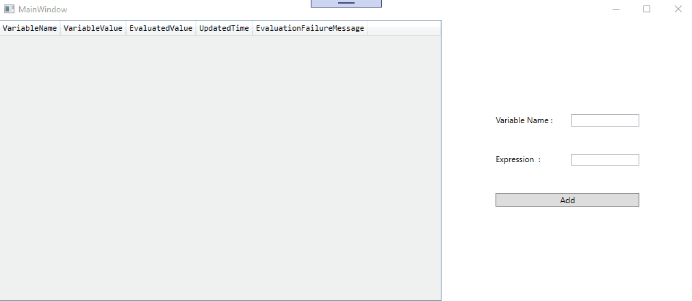

# ExpressionParser

This expression parser/evaluator is built using FParsec library and dependency tree is built along so that when a variable value changes, the respective dependent variables are notified and re-evaluated.

## Demo
 
 
## Run Project

Clone, build and run

## Algorithms used

Topological sort - To build dependency tree

Shunting yard algorithm - To handle operator precedance
